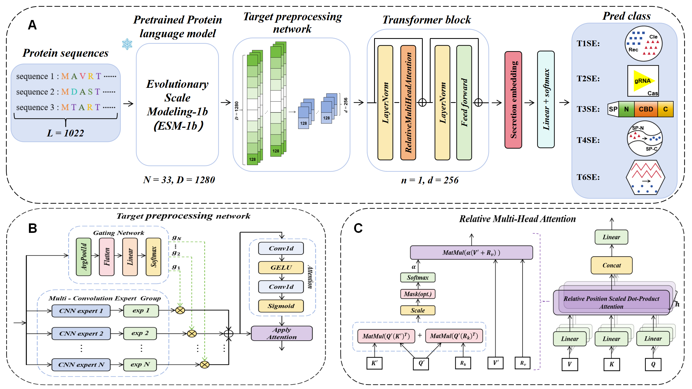

# MoCETSE

A computational method for end-to-end intelligent prediction from raw protein sequence information to effector protein recognition.


## Overview
MoCETSE enables end-to-end prediction of effector proteins from raw protein sequences through the following key steps:
- Converts raw amino acid sequences into feature vector representations using the pre-trained protein language model ESM-1b.
- Generates more expressive sequence representations via a target preprocessing network based on hybrid convolutional experts.
- Introduces relative positional encoding in the Transformer layer to explicitly model relative distances between residues, achieving high-precision prediction of secreted proteins.


## Environment Requirements
Install the required dependencies before using MoCETSE:
```
python==3.9.7
torch==1.10.2
biopython==1.79
einops==0.4.1
fair-esm>=0.4.0
tqdm==4.64.0
numpy==1.21.2
scikit-learn==0.23.2
matplotlib==3.5.1
seaborn==0.11.0
tensorboardX==2.0
umap-learn==0.5.3
warmup-scheduler==0.3.2
```


## Model Training
Run the following command to train the model (5-fold cross-validation):
```bash
for i in {0..4}
do
python train.py  --model effectortransformer \
--data_dir data \
--lr 5e-5 \
--weight_decay 4e-5 \
--lr_scheduler cosine \
--lr_decay_steps 30 \
--kfold 5 \
--fold_num $i \
--log_dir model
done
```

**Parameters explanation**:
- `--model`: Model type (default: `effectortransformer`)
- `--data_dir`: Path to the training data directory
- `--lr`: Learning rate (default: `5e-5`)
- `--weight_decay`: Weight decay (default: `4e-5`)
- `--lr_scheduler`: Learning rate scheduler (default: `cosine`)
- `--lr_decay_steps`: Learning rate decay steps (default: `30`)
- `--kfold`: Number of cross-validation folds (default: `5`)
- `--fold_num`: Current fold index (in loop: `0..4`)
- `--log_dir`: Directory to save training logs and checkpoints


## Prediction
Use the trained model for effector protein prediction with:
```bash
python predict.py --fasta_path exmples/Test.fasta \
               --model_location checkpoint.pt \
               --secretion I II III IV VI \
               --out_dir results
```

**Parameters explanation**:
- `--fasta_path`: Path to the input FASTA file (e.g., `exmples/Test.fasta`)
- `--model_location`: Path to the trained model checkpoint (e.g., `checkpoint.pt`)
- `--secretion`: Types of secretion systems to predict (e.g., `I II III IV VI`)
- `--out_dir`: Directory to save prediction results


## Model Weight
The pre-trained MoCETSE model weight can be downloaded from:  
[[https://drive.google.com/file/d/1J-E4FZmf-meSNSsjZ-96EVYmZwVICAYb/view?usp=sharing](https://drive.google.com/file/d/1J-E4FZmf-meSNSsjZ-96EVYmZwVICAYb/view?usp=sharing](https://drive.google.com/drive/my-drive))
